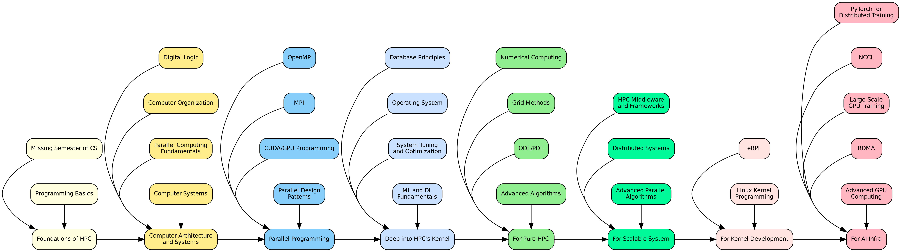

# HPC Learning Roadmap

Haibin Lai

12211612@mail.sustech.edu.cn

## 1. Foundations of HPC

After this step, you can connect to supercomputer and start your journey!

**Missing Semester of CS Education**:

- Strongly recommend you to learn all the videos:
[超算习堂](https://www.easyhpc.net/learning-path/1/step)

- [The Missing Semester of Your CS Education](https://missing-semester-cn.github.io/)
- Linux usage, IBM Spectrum LSF / Slurm usage
- git [learn_git_branching](https://learngitbranching.js.org/?locale=zh_CN)
- shell, vim, gdb

**Programming Basics**:
- Learn Python, C, or C++ (common in HPC).
- Suggested: CS50’s Introduction to Computer Science (Harvard, edX) or Learn Python the Hard Way (online book).

## 2. Computer Architecture and Systems

After this step, you will know how programs run on our computer!

**Digital logic**: 
- [geeks for geeks](https://www.geeksforgeeks.org/digital-electronics-logic-design-tutorials/)
- [UESTC](https://www.icourse163.org/course/UESTC-234014)

**Computer Organization**:
- CPU, memory hierarchy, caches, pipelining.
- [Computer Architecture: a quantitative approach](https://mxlol.gitbook.io/ji-suan-ji-ti-xi-jie-gou-liang-hua-yan-jiu-fang-fa-di-liu-ban-han-hua/qian-yan/nei-rong-gai-shu)

Suggested: Computer Organization and Design by Patterson & Hennessy (book or online lectures).

**Parallel Computing Fundamentals**:
- Concepts like Amdahl’s Law, parallelism types (task, data).
- [平行程式 周志远](https://ocw.nthu.edu.tw/ocw/index.php?page=mobile&type=chapter&cid=231&chid=2574)

Suggested: Introduction to Parallel Computing (online, University of Illinois via Coursera).

**Computer Systems**:

- How can C code runs on your machine?
- CSAPP [link](https://csdiy.wiki/%E8%AE%A1%E7%AE%97%E6%9C%BA%E7%B3%BB%E7%BB%9F%E5%9F%BA%E7%A1%80/CSAPP/)

## 3. Parallel Programming

- **OpenMP**:
    - Shared-memory parallel programming in C/C++ or Fortran.
    - Suggested: _OpenMP Tutorials_ (Lawrence Livermore National Lab) or OpenMP official [OpenMP](https://www.openmp.org/resources/tutorials-articles/)
- **MPI (Message Passing Interface)**:
    - Distributed-memory programming for clusters.
    - Suggested: _MPI Tutorial_ by Wes Kendall [MPI](https://mpitutorial.com/).

- **CUDA/Parallel GPU Programming**:
    - GPU programming for NVIDIA hardware.
    - Suggested: _CUDA Programming_ (NVIDIA Developer Program, free).
    - A must learn class if you want to do HPC research

- **Parallel Design Patterns**:
    - Divide-and-conquer, master-worker, stencil computations.
    - [PDP](https://opencsf.org/Books/csf/html/ParallelDesign.html)
    - [Intro](https://www.cnblogs.com/kaige/archive/2012/04/10/parallel_programming_patterns.html)

## 4. Deep into HPC's kernel

- **Database Principles**:

    -  (CMU 15-445/645 & 15-721): [CMU](https://15445.courses.cs.cmu.edu/fall2024/)
        
    - Key topics: Relational models, storage architectures (heaps, log-structured), indexing (B+ trees, hash tables), transaction processing (ACID, concurrency control), recovery (logging, checkpoints), and parallel/distributed query processing.

- **Operating System**:
    - Process management, memory management, scheduling.
    - Suggested: Operating Systems: Three Easy Pieces (free online book). [OSTEP](https://pages.cs.wisc.edu/~remzi/OSTEP/)
    - [MIT 6.1810](https://pdos.csail.mit.edu/6.828/2024/index.html)
    - [rCore](https://rcore-os.cn/rCore-Tutorial-Book-v3/chapter0/index.html)

- **System Tuning and Optimization**:
    - [[2009.06489] The Hardware Lottery](https://arxiv.org/abs/2009.06489)
    - TMA [top-down method](https://rcs.uwaterloo.ca/~ali/cs854-f23/papers/topdown.pdf)
    - [Performance Analysis and Tuning on Modern CPU](https://weedge.github.io/perf-book-cn/zh/)
    - USB including CPU, memory, and I/O tuning.
    - Profiling tools (e.g., perf, gprof, intel VTune), compiler optimizations (e.g., -O3, loop unrolling), and hardware-specific tuning (e.g., NUMA, cache-aware programming).

- **Machine Learning and Deep Learning Fundamentals**:

    - Understand ML and DL basics, focusing on models and architectures relevant to HPC, where parallel computing (e.g., GPU clusters) accelerates training and inference.
        
    - **Basic ML Models**:
        
        - **Decision Trees**, **Support Vector Machines (SVM)**
        - Key topics: Supervised learning (regression, classification), unsupervised learning (clustering), model evaluation (accuracy, precision, recall), and optimization (gradient descent).
            
        - Suggested: CS229: Machine Learning (Stanford, lecture notes) or Machine Learning Crash Course (Google, free).
            
    - **Deep Learning Papers**:
        
        - **AlexNet (2012)**: Introduces deep CNNs with ReLU, dropout, and GPU acceleration for image classification. Paper.
            
        - **VGG (2014)**: Deepens CNNs with small (3x3) filters for improved performance. Paper.
            
        - **ResNet (2015)**: Introduces residual connections to train very deep networks, reducing vanishing gradients. [Paper](https://arxiv.org/abs/1512.03385).
            
        - **Transformer (2017)**: Proposes attention-based architecture for NLP, scalable for HPC with parallel processing. [Attention Is All You Need](https://arxiv.org/abs/1706.03762).

## 5. For pure HPC

- **Numerical Computing**:

    - Learn numerical methods for solving mathematical problems in HPC, focusing on accuracy, stability, and parallelization.
    - Key topics: Floating-point arithmetic, numerical linear algebra (e.g., LU decomposition, iterative solvers), and optimization techniques (e.g., conjugate gradient).
    - Suggested: [Numerical Recipes](http://numerical.recipes/) (classic book, code in C/C++) or [Introduction to Scientific Computing](https://www.cs.utexas.edu/users/flame/Notes/Notes.html) (UT Austin, free notes on numerical methods).

- **Grid Methods (Mesh-Based Techniques)**:

    - Understand grid-based methods for discretizing computational domains in HPC simulations.
    - Key topics: Finite difference methods (FDM), finite element methods (FEM), and finite volume methods (FVM) for solving PDEs.
    - Suggested: [Finite Element Methods for PDEs](https://bookstore.siam.org/ot99/) (SIAM book by Brenner and Scott) or [Numerical Methods for Partial Differential Equations](https://www.coursera.org/learn/pde-numerical-methods) (Coursera, University of Michigan, covers FDM/FEM).

- [Optional] **Ordinary and Partial Differential Equations (ODE/PDE)**:

    - Learn to solve ODEs and PDEs numerically, critical for HPC applications like fluid dynamics, climate modeling, and physics simulations.
    - Key topics: Runge-Kutta methods for ODEs, explicit/implicit schemes for PDEs, and parallel solvers (e.g., domain decomposition).
    - Suggested: [Numerical Solution of Differential Equations](https://ocw.mit.edu/courses/mathematics/18-336j-numerical-methods-for-partial-differential-equations-spring-2009/) (MIT 18.336, course materials) or [DifferentialEquations.jl](https://diffeq.sciml.ai/stable/) (Julia library with tutorials for ODE/PDE solvers).
    - Note: Practice implementing solvers in parallel environments using MPI or OpenMP for scalability.

- [Optional] **Advanced Algorithms (MIT 18.337/18.338)**:

    - Study advanced algorithms optimized for HPC, emphasizing parallel and distributed computing.
    - Key topics: Parallel graph algorithms, sparse matrix computations, randomized algorithms, and high-performance data structures.
    - Suggested: [MIT 18.337J/6.338J: Parallel Computing and Scientific Machine Learning](https://github.com/mitmath/18337) (course materials, lectures, and Julia-based projects) or [MIT OpenCourseWare: Advanced Algorithms](https://ocw.mit.edu/courses/electrical-engineering-and-computer-science/6-854j-advanced-algorithms-fall-2005/) (focus on theoretical foundations).
    - Note: MIT 18.337 uses Julia for numerical computing, which is highly relevant for HPC due to its performance and parallelization capabilities.

## 6. For scalable system

- **HPC Middleware and Frameworks**:

    - Explore middleware used in HPC clusters, such as job schedulers (Slurm, PBS Pro) and resource managers.
    - Key topics: Workflow orchestration, containerization (e.g., Singularity, Docker for HPC), and cloud-HPC integration.
    - Suggested: [Slurm Workload Manager Documentation](https://slurm.schedmd.com/) or [SingularityCE User Guide](https://docs.sylabs.io/guides/latest/user-guide/).

- **Distributed Systems (MIT 6.824/6.5840)**:

    - big data idea: [GFS](https://pdos.csail.mit.edu/6.824/papers/gfs.pdf) ; [big table](https://research.google/pubs/bigtable-a-distributed-storage-system-for-structured-data/#:~:text=In%20this%20paper%20we%20describe%20the%20simple%20data,we%20describe%20the%20design%20and%20implementation%20of%20Bigtable.) ; [map reduce](https://pdos.csail.mit.edu/6.824/papers/mapreduce.pdf)
        
    - Key topics: MapReduce, Raft consensus algorithm, key-value stores, sharding, and distributed file systems (e.g., GFS, HDFS).
        
    - Suggested: MIT 6.824: Distributed Systems (course website, includes lectures, labs, and papers) or YouTube Lectures. Labs involve implementing MapReduce, Raft, and a fault-tolerant key-value store in Go.

- [Optional] **Advanced Parallel Algorithms**:
    - Study advanced algorithms for HPC, such as load balancing, fault tolerance, and scalable data structures.
    - Suggested: [Parallel and Distributed Computation: Numerical Methods](https://www.amazon.com/Parallel-Distributed-Computation-Numerical-Methods/dp/1886529019) (book by Bertsekas and Tsitsiklis) or [Introduction to High-Performance Scientific Computing](https://www.siam.org/publications/books/open-access-books/introduction-to-high-performance-scientific-computing/) (free online book).

## 7. For kernel Development

- **eBPF (Extended Berkeley Packet Filter)**:
    - Learn eBPF for advanced performance monitoring, tracing, and system optimization in HPC environments.
    - Key topics: Writing eBPF programs, using tools like `bpftrace` and `BCC`, and monitoring system calls and network performance.
    - Suggested: [eBPF.io](https://ebpf.io/) (official eBPF resources) or [Brendan Gregg’s eBPF Guide](https://www.brendangregg.com/ebpf.html) (tutorials and tools for performance analysis).

- **Linux Kernel Programming**:
    - Key topics: Kernel modules, device drivers, memory management, and kernel-level debugging.
    - Suggested: [Linux Kernel Development](https://www.kernel.org/doc/html/latest/) (official Linux kernel documentation) or [Linux Kernel Programming](https://www.packtpub.com/product/linux-kernel-programming/9781789953435) (book by Kaiwan N Billimoria).

## 8. For AI Infra

- **PyTorch for Distributed Training**:

    - Learn PyTorch to implement distributed training for AI models, enabling scalable deep learning on HPC clusters.
    - Key topics: Data parallelism (using `torch.distributed`), model parallelism, pipeline parallelism, and integration with HPC frameworks like MPI and NCCL.
    - Suggested: [PyTorch Distributed Training](https://pytorch.org/tutorials/beginner/distributed_training.html) (official PyTorch tutorials, covers `DistributedDataParallel` and `RPC`) or [Distributed Machine Learning with PyTorch](https://www.youtube.com/watch?v=0kCT2D3A0Ko) (PyTorch Lightning tutorial on YouTube). Practice with [Horovod](https://horovod.ai/) for PyTorch-based distributed training on clusters.

### Communication Part

- **NCCL (NVIDIA Collective Communications Library)**:

    - Key topics: AllReduce, Broadcast, and AllGather operations, integration with PyTorch/TensorFlow, and RDMA support for low-latency communication.
    - Suggested: [NCCL Developer Guide](https://docs.nvidia.com/deeplearning/nccl/user-guide/docs/) (official NVIDIA documentation) or [NCCL on GitHub](https://github.com/NVIDIA/nccl) (includes examples and setup for GPU clusters). Explore [NCCL Tutorials](https://developer.nvidia.com/blog/accelerating-pytorch-ddp-with-nccl/) for practical implementations.

- **Large-Scale GPU Training**:

    - GShard
    - Key topics: CUDA programming for GPUs, multi-GPU training with frameworks like PyTorch and TensorFlow, and optimization techniques (e.g., mixed precision, gradient accumulation).
    - Suggested: [NVIDIA CUDA Toolkit Documentation](https://docs.nvidia.com/cuda/) (official CUDA resources) or [CS231n: Deep Learning for Computer Vision](http://cs231n.stanford.edu/) (Stanford, includes GPU-based training labs). Practice with [NVIDIA Deep Learning AI](https://www.nvidia.com/en-us/training/) (free courses on GPU training).

- **RDMA (Remote Direct Memory Access)**:

    - Understand RDMA for high-performance networking in AI and HPC, enabling low-latency, high-throughput data transfers.
    - Key topics: InfiniBand, RoCE (RDMA over Converged Ethernet), GPUDirect RDMA, and their use in distributed AI training.
    - Suggested: [Introduction to RDMA Programming](https://www.mellanox.com/related-docs/prod_software/RDMA_Intro_and_Programming_Guide.pdf) (Mellanox/NVIDIA guide) or [High-Performance Computing with RDMA](https://www.hpcwire.com/2018/05/15/rdma-in-hpc-and-ai/) (HPCwire article). Explore NCCL’s RDMA support for GPU clusters.

### Computing part

- **Advanced GPU Computing**:

    - PTX, SASS
    - bank conflict, warp divergence
        
    - Key topics:
        
        - **Common Methods**: Parallel thread execution, kernel launches, memory coalescing, and stream processing.
            
        - **Optimization Tricks**: Minimizing warp divergence (avoiding branch divergence within warps), resolving bank conflicts in shared memory, optimizing memory access patterns, and using asynchronous data transfers.
            
        - **Principles**: GPU architecture (SMs, warps, threads), memory hierarchy (global, shared, register), and latency hiding.
            
    - Suggested: CUDA Programming Guide (official NVIDIA guide, covers warp divergence and bank conflicts) or Professional CUDA C Programming (book by John Cheng et al.). Explore CUDA Optimization Tips (NVIDIA blog on warp divergence and memory optimization). Some graph paper is also ok.

---

